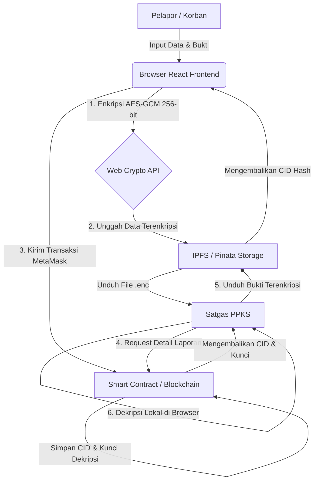

# PIJAR DApp 🛡️
**Pusat Informasi dan Jaringan Anti-Kekerasan Seksual (Platform Integritas Jurnal dan Arsip Pelaporan)**

PIJAR DApp adalah aplikasi pelaporan kekerasan seksual berbasis desentralisasi (Decentralized Application) yang dirancang untuk membantu Satgas PPKS di lingkungan kampus. Aplikasi ini mengutamakan keamanan data, integritas bukti, dan kerahasiaan identitas korban menggunakan teknologi Blockchain dan IPFS.

---

## 1. Deskripsi Sistem

Sistem PIJAR DApp dikembangkan untuk mengatasi tiga hambatan utama dalam pelaporan kekerasan seksual secara konvensional:
*   **Anonimitas & Privasi:** Login dan identitas pelapor diverifikasi menggunakan alamat dompet digital (MetaMask) secara pseudonim (tidak membutuhkan nama, NIM, atau email).
*   **Keamanan & Anti-Manipulasi Bukti:** Setiap file bukti dan kronologi dienkripsi langsung di browser pelapor menggunakan algoritma **AES-GCM 256-bit** sebelum diunggah ke jaringan penyimpanan terdesentralisasi **IPFS** via Pinata.
*   **Transparansi Pelacakan Kasus:** Status penanganan laporan dicatat secara langsung di *Smart Contract* Blockchain Ethereum. Setiap pembaruan status oleh Satgas terekam secara permanen dan tidak bisa dimanipulasi.

---

## 2. Arsitektur Sistem

Berikut adalah visualisasi alur pengiriman dan dekripsi data pelaporan pada sistem PIJAR:



### Komponen Utama:
1.  **Smart Contract (`EvidenceSystem.sol`):** Mengatur logika pelaporan on-chain, status kasus, penyimpanan alamat CID IPFS beserta kunci enkripsi simetris, dan whitelist hak akses Satgas.
2.  **IPFS (Pinata Dedicated Gateway):** Tempat penyimpanan desentralisasi untuk berkas bukti fisik terenkripsi. Dilindungi oleh otentikasi Gateway Token untuk mencegah akses tidak sah.
3.  **Metamask Provider:** Media otentikasi pseudonim pengguna dan media persetujuan transaksi di blockchain.

---

## 3. Cara Menjalankan Project

### Prasyarat (Prerequisites)
*   [Node.js](https://nodejs.org/) (versi LTS direkomendasikan)
*   Ekstensi browser [MetaMask](https://metamask.io/)

### Langkah 1: Kloning Repositori
```bash
git clone <repository-url>
cd Blockchain-Evidence
```

### Langkah 2: Jalankan Blockchain Lokal (Hardhat Node)
1.  Buka terminal baru, masuk ke direktori `blockchain`:
    ```bash
    cd blockchain
    ```
2.  Instal seluruh dependensi:
    ```bash
    npm install
    ```
3.  Jalankan node blockchain lokal:
    ```bash
    npx hardhat node
    ```
    *Biarkan terminal ini tetap berjalan (jangan ditutup).*

### Langkah 3: Deploy Smart Contract ke Jaringan Lokal
1.  Buka terminal baru lainnya (jangan matikan terminal Hardhat Node).
2.  Masuk ke direktori `blockchain`:
    ```bash
    cd blockchain
    ```
3.  Jalankan perintah deploy:
    ```bash
    npx hardhat run scripts/deploy.js --network localhost
    ```
4.  Salin alamat kontrak hasil deploy (biasanya `0x5FbDB2315678afecb367f032d93F642f64180aa3`) untuk dimasukkan ke konfigurasi frontend.

### Langkah 4: Jalankan React Frontend
1.  Buka terminal baru lainnya, masuk ke direktori `frontend`:
    ```bash
    cd frontend
    ```
2.  Instal seluruh dependensi:
    ```bash
    npm install
    ```
3.  Buat file `.env` di dalam root folder `frontend/` dan isi variabel berikut:
    ```env
    VITE_PINATA_API_KEY=your_pinata_api_key_here
    VITE_PINATA_SECRET_API_KEY=your_pinata_secret_api_key_here
    VITE_CONTRACT_ADDRESS=your_deployed_contract_address_here
    VITE_PINATA_GATEWAY=your_pinata_gateway_domain_here
    VITE_PINATA_GATEWAY_TOKEN=your_pinata_gateway_token_here
    ```
4.  Jalankan server pengembangan frontend:
    ```bash
    npm run dev
    ```
5.  Akses aplikasi melalui browser pada alamat `http://localhost:5173/`.

### Langkah 5: Konfigurasi MetaMask
1.  Buka ekstensi MetaMask Anda.
2.  Tambahkan jaringan lokal baru (Custom RPC Network):
    *   **Network Name:** Hardhat Localhost
    *   **New RPC URL:** `http://127.0.0.1:8545`
    *   **Chain ID:** `31337`
    *   **Currency Symbol:** `ETH`
3.  Impor salah satu *Private Key* akun penguji yang disediakan oleh Hardhat Node (tercetak di terminal langkah 2) ke MetaMask untuk bertransaksi menggunakan saldo ETH gratisan.
